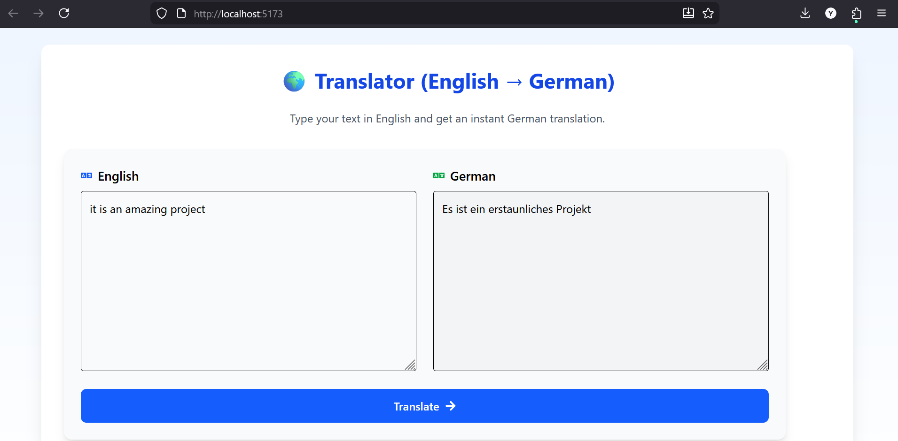

# 🌍 React Translation App (English → German)

A modern, responsive web application built with **React**, **Redux Toolkit**, and **RapidAPI (Google Translate)** that allows users to translate English text into German in real time.

This project demonstrates professional frontend architecture, API integration, state management, testing, and CI automation.

---

## 🚀 Features

-  Translate **English → German**
-  Fast and accurate Google Translation (RapidAPI)
-  Global state management with Redux Toolkit
-  Clean component architecture
-  Fully responsive UI
-  Secure API key handling via environment variables
-  Unit test coverage
-  GitHub CI pipeline

---

## 🛠 Tech Stack

| Layer | Technology |
|------|----------|
| Frontend | React (Vite) |
| Styling | Tailwind CSS |
| State Management | Redux Toolkit |
| API | Google Translate (RapidAPI) |
| Testing | Jest + React Testing Library |
| CI | GitHub Actions |

---

## API Used

API Name: Google Translate via RapidAPI

Endpoint: /translate/mini

Source Language: English (en)

Target Language: German (de)

Request Format: POST JSON


## 📂 Project Structure

src/
├── api/         # RapidAPI client
│   └── translateApi.js
├── components/  # UI components
│   ├── Translator.jsx
│   ├── TextInput.jsx
│   └── TextOutput.jsx
├── pages/       # Page containers
│   └── Home.jsx
├── store/       # Redux logic
│   ├── store.js
│   └── translationSlice.js
├── tests/       # Unit tests
│   └── Translator.test.jsx
├── App.jsx
└── main.jsx


---
## UI Showcase

### Screenshot  – Working Translator Interface



## 🔐 Environment Setup

Create a `.env` file in the project root:

```env
VITE_RAPID_API_KEY=YOUR_RAPIDAPI_KEY
VITE_RAPID_API_HOST=google-translate113.p.rapidapi.com

---
## Install & Run

npm install
npm run dev

---
## Run Tests

npm test


---

## 📌 Notes

API keys are securely stored using Vite environment variables.

The translator uses the “mini” endpoint for simple, fast translations.

For more advanced translations with synonyms and alternate writing, the full endpoint /translate can be used.

The app automatically handles loading states, API errors, and empty input.

CI pipeline runs tests and builds on every push.

The UI is mobile and desktop friendly.
